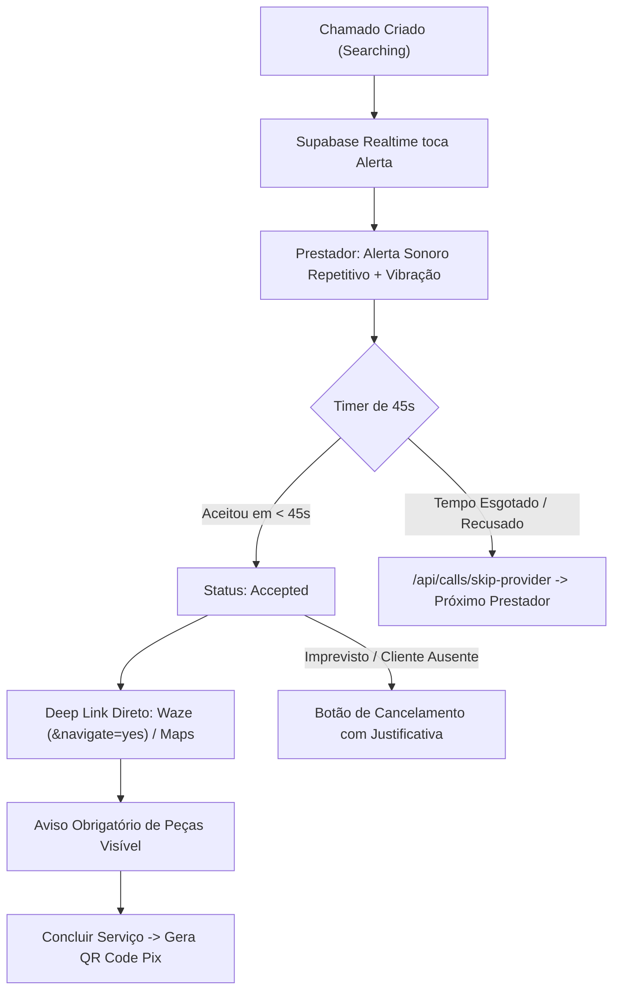

<!-- BEGIN:nextjs-agent-rules -->

# This is NOT the Next.js you know

This version has breaking changes — APIs, conventions, and file structure may all differ from your training data. Read the relevant guide in `node_modules/next/dist/docs/` (resolved from this file's directory; in monorepos the `next` package may not be visible from the repo root) before writing any code. Heed deprecation notices.

This block is written and re-added by `next dev` — verify at `node_modules/next/dist/server/lib/generate-agent-files.js`. Removing it from a diff only re-creates the uncommitted change; committing it with your work keeps the tree clean.

<!-- END:nextjs-agent-rules -->

# Repara RV — Documentação Arquitetural e Diretrizes de Engenharia (AI_CONTEXT)

Documento mestre de arquitetura, padrões de engenharia, diretrizes de Garantia de Qualidade de Software (SQA - Sommerville & Pressman) e especificações técnicas de campo para o ecossistema **Repara RV**.

---

## 1. Visão Geral do Produto

O **Repara RV** é um Progressive Web App (PWA) sob demanda estilo Uber voltado para serviços manuais e reparos residenciais em **Rio Verde (GO)**. O sistema conecta moradores a profissionais autônomos locais com geolocalização em tempo real, catálogo padronizado com preço fixo fechado, zero burocracia de orçamentos e repasse financeiro automatizado via Pix.

### Proposta de Valor
* **Sem Orçamento Demorado:** Catálogo de serviços essenciais tabelados (troca de chuveiro, torneira, tomada, desentupimento, etc.).
* **Chamada Instantânea no Radar:** Busca do profissional online mais próximo via PostGIS (operador `<->`).
* **Modelo estilo Uber:** O prestador mais próximo recebe o alerta com som e vibração e tem 45 segundos para aceitar.
* **Transparência de Custos:** Avisos ostensivos de que peças e insumos correm por conta do cliente (mão de obra pura).
* **Zero Moedas / Sem Venda de Leads:** O profissional não paga para orçar. Cobrança de taxa de intermediação fixa retida no ato do pagamento Pix final.

---

## 2. Stack Tecnológica

| Camada | Tecnologia | Justificativa Técnica |
| :--- | :--- | :--- |
| **Framework Web** | Next.js 16 (App Router + Turbopack) | Server Components, Server Actions e máxima velocidade de compilação. |
| **Linguagem** | TypeScript 5 (Modo Estrito) | `"strict": true`, tipagem centralizada em `lib/types.ts` sem uso de `any`. |
| **Estilização & UI** | Tailwind CSS 4 + Lucide Icons | Design system limpo inspirado na **Triider**, responsivo e mobile-first. |
| **Banco de Dados** | Supabase (PostgreSQL 15 em São Paulo `sa-east-1`) | Menor latência para Goiás ($\approx 15\text{ms}$), escalabilidade e segurança. |
| **Motor Geoespacial** | PostGIS (`GEOMETRY(Point, 4326)`) | Indexação GIST com busca KNN (`<->`) para matching instantâneo de raio. |
| **Mensageria Realtime** | Supabase Realtime (WebSockets) | Alertas push imediatos para o radar do prestador sem necessidade de polling. |
| **Pagamentos & Split** | Mercado Pago SDK (Pix) | Geração de QR Code dinâmico, Copia e Cola e Webhook com idempotência bancária. |
| **Qualidade & Testes** | Vitest | Execução ultrarrápida em ESM nativo com fake timers e cobertura de regras críticas. |

---

## 3. Diretrizes de Design & Identidade Visual (Estilo Triider)

A interface segue rigorosamente a estética limpa, confiável e humanizada da **Triider**:

* **Paleta de Cores:**
  * **Fundo:** Slate 50 ultra limpo (`#F8FAFC`) e branco puro (`#FFFFFF`) para os cards.
  * **Tipografia:** Slate 900 (`#0F172A`) para títulos e `slate-600` para descrições.
  * **Ação Primária / CTA:** Laranja/Coral vibrante (`#F97316` / `#EA580C`).
  * **Selos de Segurança:** Verde esmeralda (`#10B981`) para garantias e verificações.
* **Geometria & Espaçamento:** Cantos arredondados generosos (`rounded-2xl` a `rounded-3xl`), sombras discretas (`shadow-sm` a `shadow-md`) e breathing room de 16 a 24px entre módulos.
* **Mobile-First Real:** O container do cliente é restrito e centrado (`max-w-md mx-auto`), emulando um aplicativo nativo instalado com barra de navegação inferior fixa.

---

## 4. Arquitetura da Home Page (`app/(client)/page.tsx`)

A tela inicial do cliente foi estruturada nos 6 blocos canônicos da Triider:

1. **Header com Localizador Regional:** Logotipo Repara RV + seletor dinâmico com modal para os 13 principais bairros de Rio Verde (Setor Central, Bairro Popular, Promissão, Morada do Sol, Santo Agostinho, etc.) + atalho discreto "Sou Profissional".
2. **Hero com Busca Instantânea:** Título acolhedor (*"O que você precisa consertar hoje?"*) + campo de busca com autocomplete em tempo real e chips de atalho rápido.
3. **Grid de Categorias:** 6 categorias visuais (⚡ Elétrica, 💧 Hidráulica, 🔨 Pequenos Reparos, 🛋️ Montagem, 🎨 Pintura, 🚨 Emergência 24h) com filtro reativo.
4. **Grid de Serviços Mais Pedidos:** Cards verticais com SLA estimado (*"Até 40 min"*), tag de garantia de 30 dias, preço transparente (*"A partir de R$ 70,00"*) e botão de ação direta *"Chamar Agora"*.
5. **Banner de Confiança e Garantia (Pilar Triider):** Card reforçando garantia de 30 dias, profissionais 100% verificados com antecedentes checados e pagamento seguro via Pix retido até o término.
6. **Bottom Navigation Fixa:** Barra inferior com 4 abas essenciais (🏠 Início, 📋 Meus Pedidos, 💬 Suporte WhatsApp, 👤 Perfil).

---

## 5. Os 5 Requisitos de Sobrevivência de Campo (Operação Real da Moto)

Desenvolvidos para a realidade de Rio Verde, onde o prestador está em trânsito de moto e o cliente precisa de socorro imediato:



1. **Áudio e Vibração Contínuos ([`hooks/useCallAlert.ts`](file:///c:/Users/kravb/Downloads/REPARA%20RV/repara-rv/hooks/useCallAlert.ts)):**
   * Sintetizador via Web Audio API com toque estilo sirene/corrida que toca em loop repetitivo mesmo com o celular no bolso ou suporte da moto.
   * Acionamento da API nativa de vibração: `navigator.vibrate([300, 100, 300])`.
2. **Janela de Aceite de 45 Segundos ([`hooks/useAcceptTimer.ts`](file:///c:/Users/kravb/Downloads/REPARA%20RV/repara-rv/hooks/useAcceptTimer.ts) & [`components/call-alert-modal.tsx`](file:///c:/Users/kravb/Downloads/REPARA%20RV/repara-rv/components/call-alert-modal.tsx)):**
   * Cronômetro SVG circular animado com contagem regressiva de 45s.
   * Se o prestador não responder a tempo, dispara automaticamente `/api/calls/skip-provider`, adicionando o prestador ao array de `excluded_ids` e repassando o chamado para o próximo profissional mais próximo.
3. **Deep Link Direto para GPS ([`components/navigation-buttons.tsx`](file:///c:/Users/kravb/Downloads/REPARA%20RV/repara-rv/components/navigation-buttons.tsx)):**
   * Link nativo para o Waze com navegação imediata: `https://waze.com/ul?ll={lat},{lng}&navigate=yes`.
   * Link nativo para o Google Maps com coordenadas e contexto de Rio Verde (GO).
4. **Alerta Ostensivo sobre Peças e Materiais:**
   * Inserido em 3 camadas: no catálogo, na tela de confirmação do cliente com **checkbox obrigatório** para poder enviar o chamado, e na tela de execução do prestador para evitar conflitos no imóvel.
5. **Botão de Cancelamento Estruturado ([`app/api/calls/cancel/route.ts`](file:///c:/Users/kravb/Downloads/REPARA%20RV/repara-rv/app/api/calls/cancel/route.ts)):**
   * Cancelamento gratuito para o cliente enquanto estiver em busca (`searching`).
   * Cancelamento documentado para o prestador com 4 motivos operacionais (`provider_absent`, `wrong_address`, `technical_issue`, `other`).

---

## 6. Garantia de Qualidade de Software (SQA - Pressman & Sommerville)

### A. Matriz de Métricas e Aferição

| Categoria | Métrica | Alvo / Meta | Status Atual |
| :--- | :--- | :--- | :--- |
| **Previsão** | Tipagem Estrita TypeScript | 0 erros de compilação, 0 tipos `any` | ✅ Aprovado (13 rotas compiladas) |
| **Previsão** | Complexidade Ciclomática | $< 10$ caminhos por função | ✅ Aprovado |
| **Previsão** | Invariante Financeira | `provider_cut + platform_fee === total` | ✅ Validado via Vitest |
| **Previsão** | Janela de Aceite (Timer) | Exatamente 45 segundos com callback | ✅ Validado via Fake Timers |
| **Controle** | Tempo de Execução de Testes | $< 500\text{ms}$ para suíte unitária | ✅ 15 testes em 226ms |
| **Controle** | RLS e Integridade de Dados | Isolamento de dados por usuário | ✅ Configurado no PostgreSQL |

### B. Suíte de Testes Automatizados ([Vitest](file:///c:/Users/kravb/Downloads/REPARA%20RV/repara-rv/package.json))
Execução: `npm test`

* **[`__tests__/utils.test.ts`](file:///c:/Users/kravb/Downloads/REPARA%20RV/repara-rv/__tests__/utils.test.ts):** Formatação de moeda brasileira (BRL), geração de links geoespaciais Waze/Google Maps e mapeamento de badges de status.
* **[`__tests__/business_logic.test.ts`](file:///c:/Users/kravb/Downloads/REPARA%20RV/repara-rv/__tests__/business_logic.test.ts):** Repasse financeiro mínimo de 70% para o trabalhador em todos os serviços e validação de telefones com DDD 64/62 e OTPs de 6 dígitos.
* **[`__tests__/timer.test.ts`](file:///c:/Users/kravb/Downloads/REPARA%20RV/repara-rv/__tests__/timer.test.ts):** Ciclo de vida da contagem de 45 segundos, cálculo de percentual circular e prevenção de race conditions.

---

## 7. Modelo de Dados e Banco Relacional ([`supabase/schema.sql`](file:///c:/Users/kravb/Downloads/REPARA%20RV/repara-rv/supabase/schema.sql))

O banco de dados é hospedado no Supabase em **São Paulo (`sa-east-1`)**, projeto `lvjahufllclmkqcbbrcu`:

```
┌─────────────────────────────────┐
│           auth.users            │
└────────────────┬────────────────┘
                 │ 1:1
┌────────────────▼────────────────┐         1:1         ┌───────────────────────────────┐
│            profiles             ├─────────────────────┤        provider_status        │
│  id, role, full_name, phone...  │                     │ provider_id, is_online,       │
└────────────────┬────────────────┘                     │ current_location (POINT 4326) │
                 │ 1:N (client/provider)                │ pix_key, pix_key_type...      │
┌────────────────▼────────────────┐                     └───────────────────────────────┘
│         service_calls           │
│  id, client_id, provider_id     │         N:1         ┌───────────────────────────────┐
│  service_id, total_price,       ├─────────────────────┤        quick_services         │
│  status, client_location,       │                     │ id, name, category,           │
│  cancel_reason, payment_status..│                     │ fixed_price, platform_fee...  │
└────────────────┬────────────────┘                     └───────────────────────────────┘
                 │ 1:1
┌────────────────▼────────────────┐
│        service_ratings          │
│  id, call_id, rating, comment   │
└─────────────────────────────────┘
```

### Principais Objetos de Banco:
* **`find_nearest_provider(call_location, excluded_ids)`:** Função PostgreSQL em PL/pgSQL com operador `<->` (K-Nearest Neighbors) sobre índice GIST para ordenação instantânea por distância.
* **Políticas RLS Não-Recursivas:** Leitura segura de perfis e catálogos e permissão estrita de update para donos de registros (`auth.uid() = id`).
* **Realtime Ativo:** Publicação configurada em `service_calls` e `provider_status`.

---

## 8. Estrutura Real do Repositório

```text
repara-rv/
├── __tests__/                  # Suíte de testes automatizados Vitest (SQA)
│   ├── business_logic.test.ts  # Testes de split de taxas e validação
│   ├── timer.test.ts           # Testes da janela de aceite de 45s
│   └── utils.test.ts           # Testes de moeda, Waze e Maps
├── app/
│   ├── (client)/
│   │   └── page.tsx            # Home estilo Triider (busca, categorias, garantias)
│   ├── acompanhar/[callId]/    # Tracker em tempo real para o cliente com modal Pix
│   ├── chamado/[callId]/       # Painel do chamado aceito pelo prestador com Waze
│   ├── chamar/[serviceId]/     # Seleção de endereço + checkbox obrigatório de peças
│   ├── login/                  # Autenticação OTP + atalhos para modo demonstração
│   ├── onboarding/             # Cadastro de perfil (cliente ou prestador com chave Pix)
│   ├── painel/                 # Dashboard do prestador com toggle online e radar
│   ├── api/
│   │   ├── calls/create/       # Criação de chamado com matching PostGIS
│   │   ├── calls/skip-provider/# Pulo para próximo prestador (rejeição ou 45s timeout)
│   │   ├── calls/cancel/       # Cancelamento auditado com motivo
│   │   ├── pix/create/         # Criação de cobrança Mercado Pago + fallback mock
│   │   ├── pix/webhook/        # Webhook bancário com idempotência
│   │   └── auth/signout/       # Encerramento de sessão
│   ├── globals.css             # Design system completo da Triider
│   └── layout.tsx              # Metadados PWA, fontes e Toaster
├── components/
│   ├── call-alert-modal.tsx    # Modal com timer 45s, áudio e vibração
│   ├── call-status-tracker.tsx # Tracker com anéis pulsantes de radar
│   ├── navigation-buttons.tsx  # Botões do Waze e Google Maps com deep link
│   ├── pix-payment-modal.tsx   # Modal com QR Code Pix dinâmico e Copia e Cola
│   └── service-card.tsx        # Card individual de serviço com aviso de peças
├── hooks/
│   ├── useAcceptTimer.ts       # Contador regressivo de 45 segundos
│   ├── useCallAlert.ts         # Sintetizador de áudio contínuo e vibração
│   └── useGeolocation.ts       # GPS do celular (one-shot e watch contínuo)
├── lib/
│   ├── catalog.ts              # Catálogo padronizado de Rio Verde
│   ├── types.ts                # Tipos TypeScript centrais
│   ├── utils.ts                # Utilitários de moeda, geolocalização e classes
│   └── supabase/
│       ├── client.ts           # Cliente Supabase para o navegador
│       ├── server.ts           # Cliente Supabase com Service Role para APIs
│       └── middleware.ts       # Verificação de sessão e rotas protegidas
├── public/
│   ├── manifest.json           # Manifesto PWA instalável
│   ├── icons/                  # Ícones em 192px e 512px
│   └── sounds/alert.mp3        # Áudio de alerta de corrida
├── supabase/
│   └── schema.sql              # Schema PostgreSQL idempotente com PostGIS e RLS
├── proxy.ts                    # Middleware do Next.js 16 com proteção de rotas
├── .env.local                  # Credenciais reais do Supabase e Mercado Pago
└── package.json                # Dependências, scripts dev, build e test
```

---

## 9. Status Real de Implementação

* [x] **Arquitetura de Negócio e Catálogo:** Catálogo padronizado com preço fechado para Rio Verde.
* [x] **Banco Relacional & PostGIS:** Supabase provisionado em São Paulo (`lvjahufllclmkqcbbrcu`) com PostGIS e RLS.
* [x] **PWA & Next.js 16 App Router:** Setup completo com `proxy.ts`, Turbopack e manifest PWA.
* [x] **5 Requisitos Operacionais de Campo:** Áudio, vibração, timer 45s, deep links Waze/Maps e aviso de materiais.
* [x] **Layout & UX Triider:** Home redesenhada com busca instantânea, categorias, garantias e bottom navigation.
* [x] **Garantia de Qualidade (SQA):** Vitest configurado e 15 testes unitários aprovados com 100% de sucesso.
* [x] **Integração Financeira Pix:** Mercado Pago configurado com split automático e fallback de desenvolvimento.
* [x] **Modo Demonstração / Sandbox:** Acesso imediato em 1 clique para testar fluxos sem dependência de SMS.
